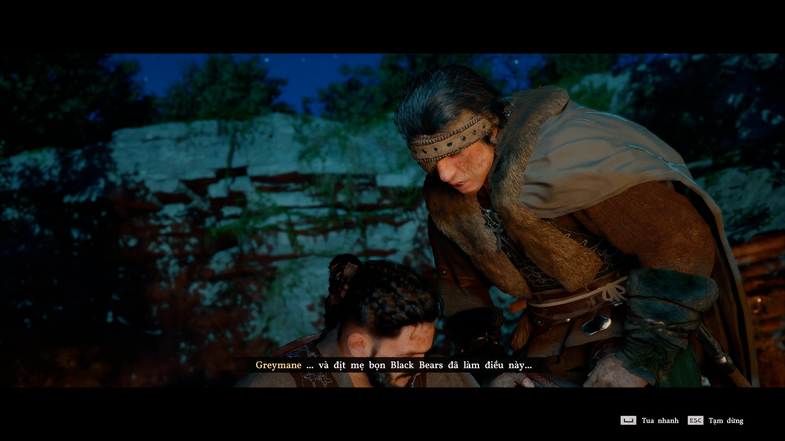
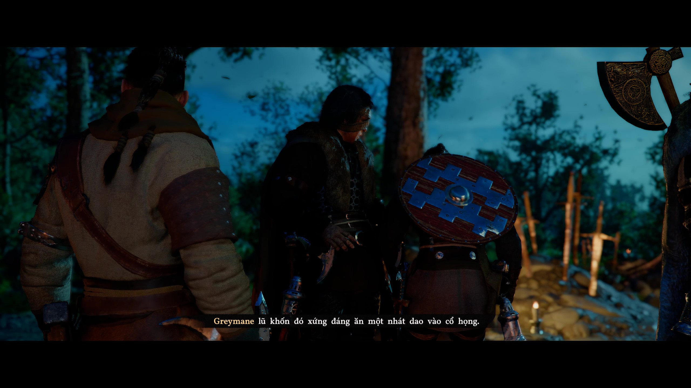
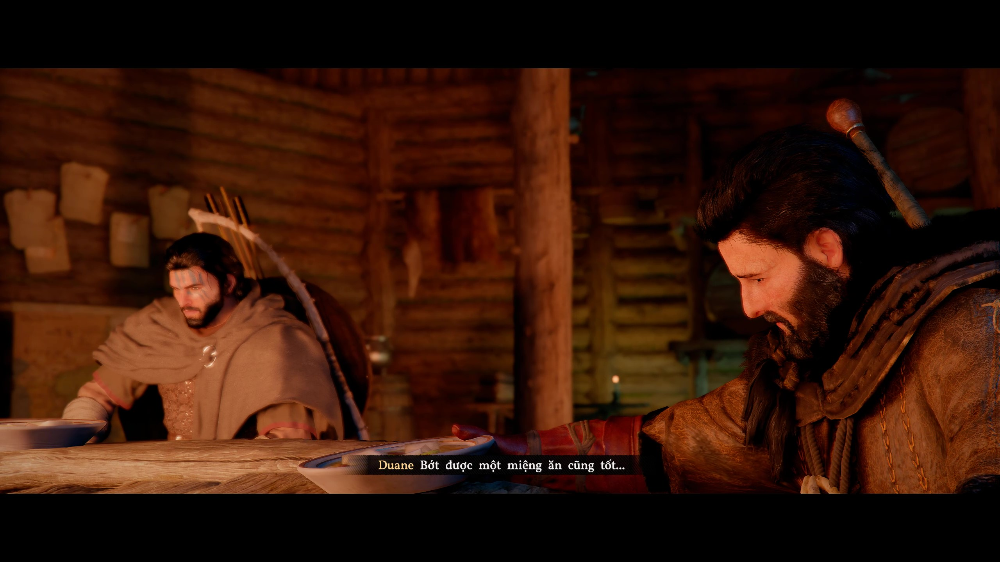
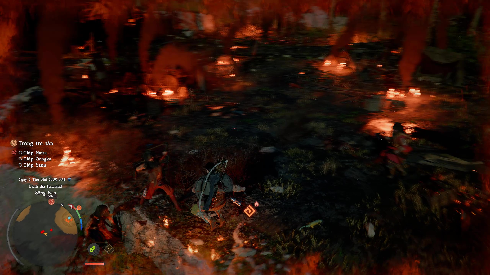
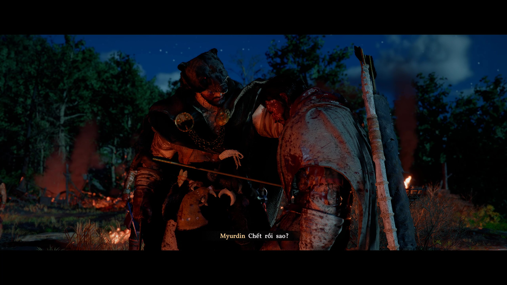
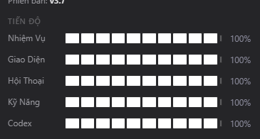

# Crimson Desert

Crimson Desert là một bản trường ca phiêu lưu thấm đẫm máu và thép, trải rộng khắp đại lục Pywel bao la. Hãy kề vai sát cánh cùng dũng sĩ Kliff trên chuyến viễn chinh phục hưng uy danh của thế lực Greymane, và cứu rỗi bờ cõi khỏi mầm tai ương đang chực chờ giáng xuống. Từ miền hoang dã mênh mang cùng những bá thành đồ sộ, cho tới các phế tích suy tàn và Vực Thẳm đầy uẩn khúc, hãy vung gươm rèn giũa vận mệnh của chính mình qua khói lửa chiến chinh và những dặm dài kỳ ngộ.

## Hình ảnh

  
  

  
  

  
  

  
  

---

## Bản Việt Hóa — Mèo Chill Team

Bản việt hóa **Crimson Desert** do **[Mèo Chill Team](https://meochill.com)** thực hiện, mang trải nghiệm đồng bộ ngôn ngữ cho cộng đồng người chơi Việt Nam — từ nhiệm vụ, giao diện, hội thoại đến kỹ năng và Codex.

### Tiến độ (phiên bản việt hóa **v5.7**)

| Hạng mục   | Tiến độ |
| ---------- | ------- |
| Nhiệm Vụ   | 100%    |
| Giao Diện  | 100%    |
| Hội Thoại  | 100%    |
| Kỹ Năng    | 100%    |
| Codex      | 100%    |

  

### Liên kết

| | |
| --- | --- |
| **Tải việt hóa** | [https://meochill.com](https://meochill.com) |
| **Discord — Mèo Chill Team** | [https://discord.com/invite/ndxmCFFzwR](https://discord.com/invite/ndxmCFFzwR) |

---

*Repository này giới thiệu game và bản việt hóa không chính thức; vui lòng tải patch và cập nhật từ nguồn Mèo Chill Team.*
